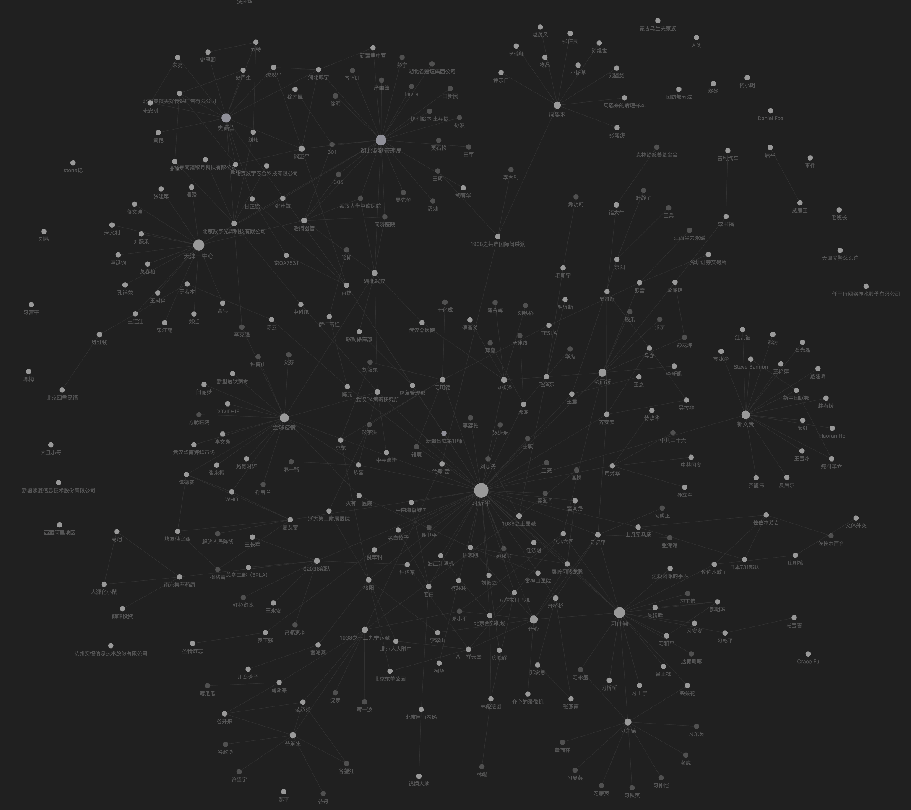

# 中共家族关系图谱

本项目交互式地展示中共内部各家族、个人的所有相关信息。所有资讯收集自互联网，欢迎补充和修正。This project interactively shows all relevant information about various families and individuals within the Chinese Communist Party. All information is collected from the Internet, additions and corrections are welcome.

## 全局图 Overview

持续更新中

## 目录 Directories

- `template` 包含各分类的默认模板格式
- `事件` 比较有影响力的事件，独立出来详细描述
- `人物` 中共家族所有相关人物、单位和公司主体
- `地点` 相关的主要地点
- `物品` 相关物品描述
- `背景` 与中共相关各家族势力描述

## 使用 Usage

- 下载安装[Obsidian](https://obsidian.md/)，这是一个基于Markdown的知识库工具。Download and install [Obsidian](https://obsidian.md/) which is a Markdown-based knowledge base.
- 克隆本项目到本地，从Obsidian里作为一个库打开本项目。Clone this project and open it from Obsidian as a Vault.
- 打开图表即可查看。Open local graph.

## 贡献 Contribute

- Fork本项目。Fork this project.
- 在你本地修改。Edit locally.
- 提交Pull Request。Commit and pull request.
